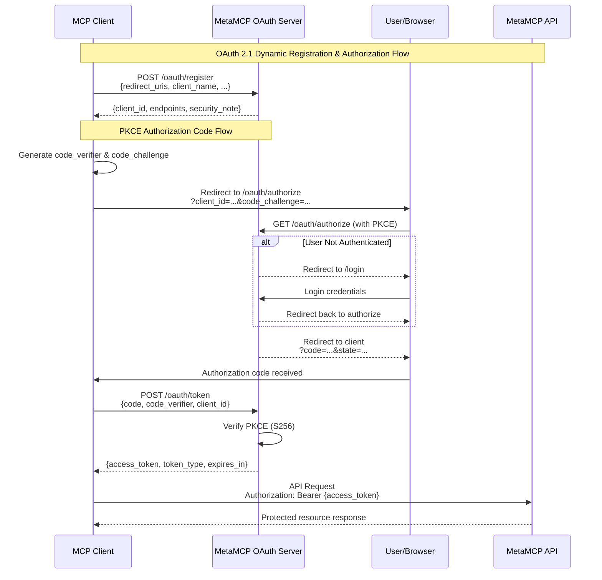
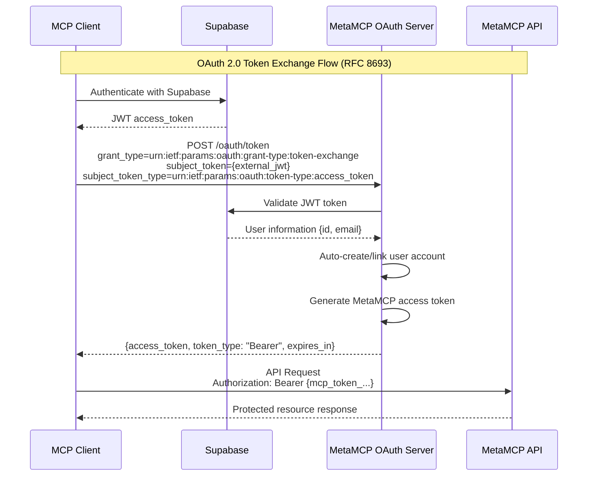

## OAuth

## OAuth 2.1 Authorization Code Flow



## OAuth 2.0 Token Exchange (RFC 8693)

MetaMCP supports OAuth 2.0 Token Exchange for single sign-on integration with Supabase.

### Token Exchange Flow



### Configuration

Add these environment variables to enable token exchange with external providers:

```bash
# Supabase Configuration (Required for Supabase JWT validation)
SUPABASE_URL=https://your-project.supabase.co
SUPABASE_ANON_KEY=your-supabase-anon-key
```

### Namespace-Specific Token Exchange

For namespace-scoped access, use the namespace-specific endpoint:

```bash
POST /metamcp/{namespace-endpoint}/oauth/token
```

### Usage Example

```bash
# Exchange Supabase JWT for MetaMCP token
curl -X POST http://localhost:12009/oauth/token \
  -H "Content-Type: application/json" \
  -d '{
    "grant_type": "urn:ietf:params:oauth:grant-type:token-exchange",
    "subject_token": "eyJ...",
    "subject_token_type": "urn:ietf:params:oauth:token-type:access_token"
  }'

# Response
{
  "access_token": "mcp_token_...",
  "token_type": "Bearer",
  "expires_in": 3600,
  "scope": "admin"
}
```

### Features

- **Auto Account Linking**: Automatically links external user accounts to local MetaMCP users by email
- **Supabase Integration**: Built-in JWT validation for Supabase authentication
- **Backward Compatible**: Works alongside existing Better Auth and OAuth 2.1 flows
- **Namespace Support**: Per-namespace token exchange for scoped access
- **Security**: Validates external JWTs before issuing MetaMCP tokens

### Provider Support

Currently supported:
- ✅ **Supabase** - Built-in JWT validation

To add support for additional providers, extend the `validateSubjectToken()` function in `apps/backend/src/routers/oauth/utils.ts`.