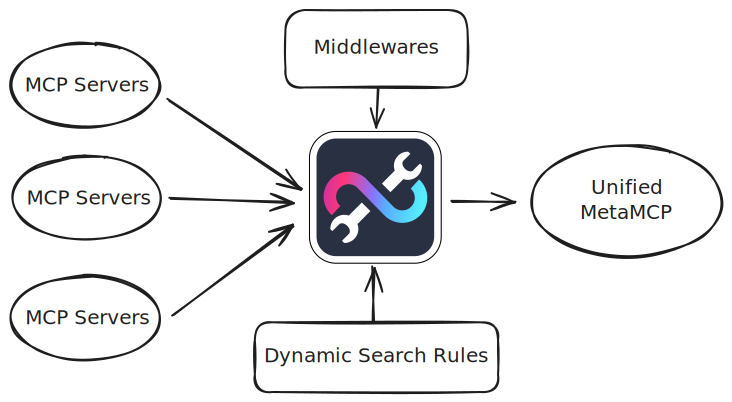
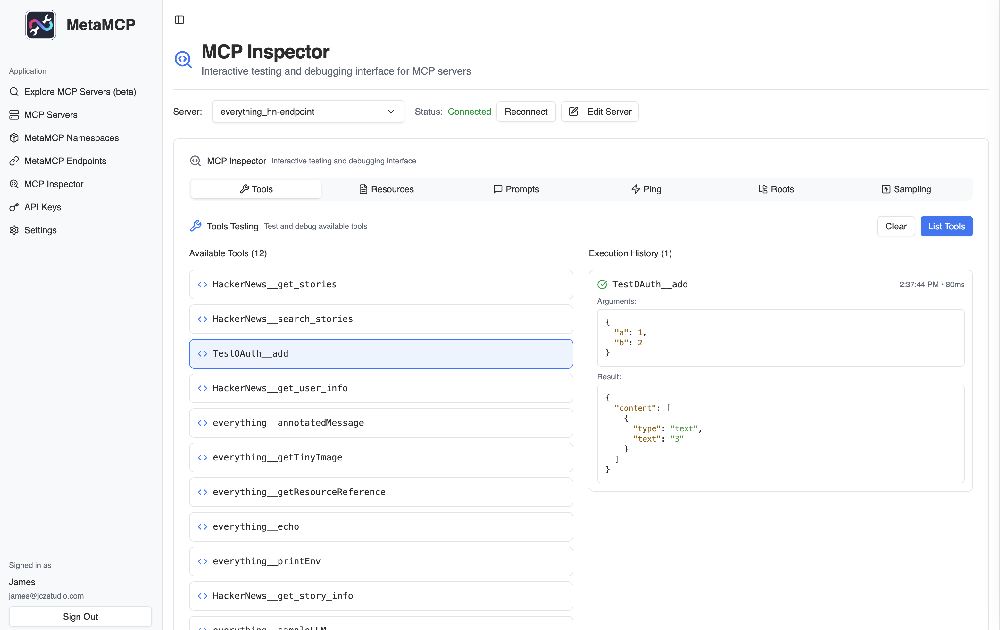
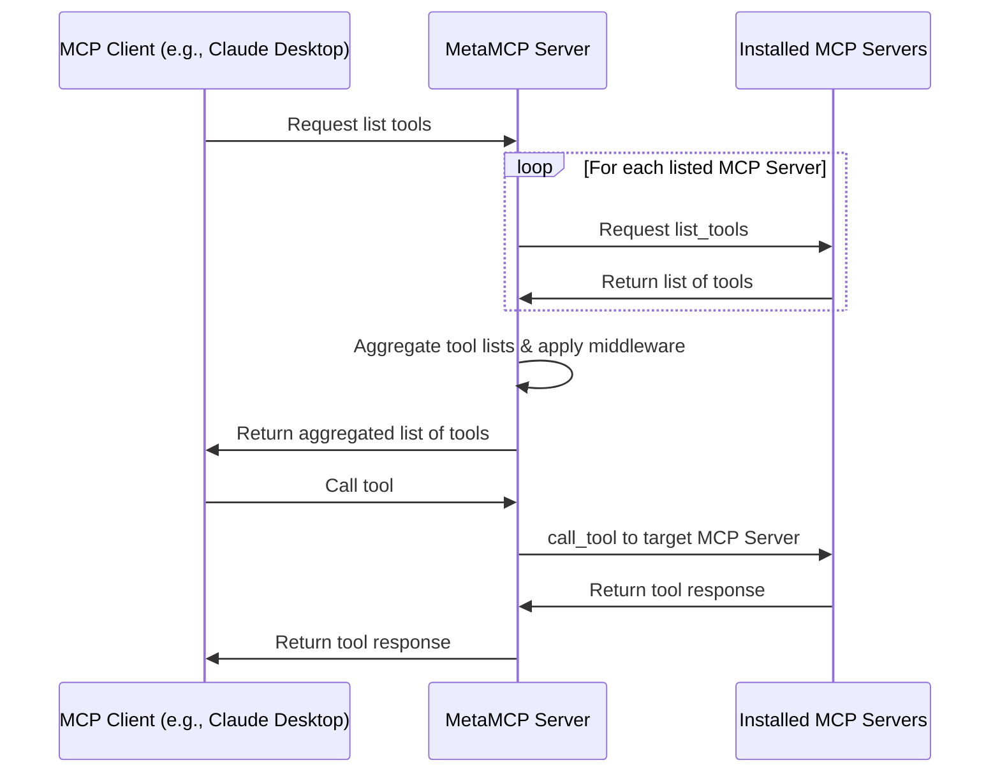

# 🚀 MetaMCP (MCP Aggregator, Orchestrator, Middleware, Gateway in one docker)

<div align="center">

<div align="center">
  <a href="https://discord.gg/mNsyat7mFX" style="text-decoration: none;">
    
  </a>
  <a href="https://docs.metamcp.com" style="text-decoration: none;">
    
  </a>
  <a href="https://opensource.org/licenses/MIT" style="text-decoration: none;">
    
  </a>
  <a href="https://github.com/metatool-ai/metamcp/pkgs/container/metamcp" style="text-decoration: none;">
    
  </a>
  <a href="https://deepwiki.com/metatool-ai/metamcp"></a>
</div>

</div>

**MetaMCP** is a MCP proxy that lets you dynamically aggregate MCP servers into a unified MCP server, and apply middlewares. MetaMCP itself is a MCP server so it can be easily plugged into **ANY** MCP clients.



---

For more details, consider visiting our documentation site: https://docs.metamcp.com

English | [中文](./README_cn.md)

## 📋 Table of Contents

- [🎯 Use Cases](#-use-cases)
- [📖 Concepts](#-concepts)
  - [🖥️ MCP Server](#️-mcp-server)
  - [🏷️ MetaMCP Namespace](#️-metamcp-namespace)
  - [🌐 MetaMCP Endpoint](#-metamcp-endpoint)
  - [⚙️ Middleware](#️-middleware)
  - [🔍 Inspector](#-inspector)
- [🚀 Quick Start](#-quick-start)
  - [🐳 Run with Docker Compose (Recommended)](#-run-with-docker-compose-recommended)
  - [💻 Local Development](#-local-development)
- [🔌 MCP Protocol Compatibility](#-mcp-protocol-compatibility)
- [🔗 Connect to MetaMCP](#-connect-to-metamcp)
  - [📝 E.g., Cursor via mcp.json](#-eg-cursor-via-mcpjson)
  - [🖥️ Connecting Claude Desktop and Other STDIO-only Clients](#️-connecting-claude-desktop-and-other-stdio-only-clients)
  - [🔧 API Key Auth Troubleshooting](#-api-key-auth-troubleshooting)
- [❄️ Cold Start Problem and Custom Dockerfile](#️-cold-start-problem-and-custom-dockerfile)
- [🔐 Authentication](#-authentication)
- [🔗 OpenID Connect (OIDC) Provider Support](#-openid-connect-oidc-provider-support)
  - [🛠️ Configuration](#️-configuration)
  - [🏢 Supported Providers](#-supported-providers)
  - [🔒 Security Features](#-security-features)
  - [📱 Usage](#-usage)
- [🌐 Custom Deployment and SSE conf for Nginx](#-custom-deployment-and-sse-conf-for-nginx)
- [🏗️ Architecture](#️-architecture)
  - [📊 Sequence Diagram](#-sequence-diagram)
- [🗺️ Roadmap](#️-roadmap)
- [🌐 i18n](#-i18n)
- [🤝 Contributing](#-contributing)
- [📄 License](#-license)
- [🙏 Credits](#-credits)


## 🎯 Use Cases
- 🏷️ **Group MCP servers into namespaces, host them as meta-MCPs, and assign public endpoints** (SSE or Streamable HTTP), with auth. One-click to switch a namespace for an endpoint.
-  🎯 **Pick tools you only need when remixing MCP servers.** Apply other **pluggable middleware** around observability, security, etc. (coming soon)
-  🔍 **Use as enhanced MCP inspector** with saved server configs, and inspect your MetaMCP endpoints in house to see if it works or not.
-  🔍 **Use as Elasticsearch for MCP tool selection** (coming soon)

Generally developers can use MetaMCP as **infrastructure** to host dynamically composed MCP servers through a unified endpoint, and build agents on top of it.

Quick demo video: https://youtu.be/Cf6jVd2saAs



## 📖 Concepts

### 🖥️ **MCP Server**
A MCP server configuration that tells MetaMCP how to start a MCP server.

```json
"HackerNews": {
  "type": "STDIO",
  "command": "uvx",
  "args": ["mcp-hn"]
}
```

#### 🔐 **Environment Variables & Secrets (STDIO MCP Servers)**

For **STDIO MCP servers**, MetaMCP supports three ways to handle environment variables and secrets:

**1. Raw Values** - Direct string values (not recommended for secrets):
```
API_KEY=your-actual-api-key-here
DEBUG=true
```

**2. Environment Variable References** - Use `${ENV_VAR_NAME}` syntax:
```
API_KEY=${OPENAI_API_KEY}
DATABASE_URL=${DB_CONNECTION_STRING}
```

**3. Auto-matching** - If the expected environment variable name in your tool matches the container's environment variable, you can omit it entirely. MetaMCP will automatically pass through matching environment variables.

> **🔒 Security Note**: Environment variable references (`${VAR_NAME}`) are resolved from the MetaMCP container's environment at runtime. This keeps actual secret values out of your configuration and git repository.

> **⚙️ Development Note**: For local development with `pnpm run dev:docker`, ensure your environment variables are listed in `turbo.json` under `globalEnv` to be passed to the development processes. This is not required for production Docker deployments.

### 🏷️ **MetaMCP Namespace**
- Group one or more MCP servers into a namespace
- Enable/disable MCP servers or at tool level
- Apply middlewares to MCP requests and responses

### 🌐 **MetaMCP Endpoint**
- Create endpoints and assign namespace to endpoints
- Multiple MCP servers in the namespace will be aggregated and emitted as a MetaMCP endpoint
- Choose between API-Key Auth (in header or query param) or standard OAuth in MCP Spec 2025-06-18
- Host through **SSE** or **Streamable HTTP** transports in MCP and **OpenAPI** endpoints for clients like [Open WebUI](https://github.com/open-webui/open-webui)

### ⚙️ **Middleware**
- Intercepts and transforms MCP requests and responses at namespace level
- **Built-in example**: "Filter inactive tools" - optimizes tool context for LLMs
- **Future ideas**: tool logging, error traces, validation, scanning

### 🔍 **Inspector**
Similar to the official MCP inspector, but with **saved server configs** - MetaMCP automatically creates configurations so you can debug MetaMCP endpoints immediately.

## 🚀 Quick Start

### **🐳 Run with Docker Compose (Recommended)**

Clone repo, prepare `.env`, and start with docker compose:

```bash
git clone https://github.com/metatool-ai/metamcp.git
cd metamcp
cp example.env .env
docker compose up -d
```

### **🔧 Environment Variables Setup**

#### **Required Environment Variables**

Create a `.env` file in the project root with the following variables:

```bash
# === CORE APPLICATION SETTINGS ===
NODE_ENV=production
APP_URL=http://localhost:12008
NEXT_PUBLIC_APP_URL=http://localhost:12008
BETTER_AUTH_SECRET=your-super-secret-key-change-this-in-production

# === DATABASE CONFIGURATION ===
POSTGRES_HOST=postgres
POSTGRES_PORT=5432
POSTGRES_USER=metamcp_user
POSTGRES_PASSWORD=m3t4mcp
POSTGRES_DB=metamcp_db
POSTGRES_EXTERNAL_PORT=9433

# === DOCKER NETWORKING ===
TRANSFORM_LOCALHOST_TO_DOCKER_INTERNAL=true
```

#### **🌊 OceanX Integration Variables**

For the OceanX-specific setup with Google Analytics and Azure PostgreSQL:

```bash
# === GOOGLE ANALYTICS 4 INTEGRATION ===
# Path to your Google Cloud service account credentials JSON file
GA4_SERVICE_ACCOUNT_JSON=/tmp/ga-credentials.json

# === AZURE POSTGRESQL INTEGRATION ===
# Azure access token for PostgreSQL authentication
AZURE_ACCESS_TOKEN=your-azure-access-token-here
```

#### **🔐 Optional: OIDC Authentication**

For enterprise SSO integration:

```bash
# === OIDC PROVIDER CONFIGURATION (Optional) ===
OIDC_CLIENT_ID=your-oidc-client-id
OIDC_CLIENT_SECRET=your-oidc-client-secret
OIDC_DISCOVERY_URL=https://your-oidc-provider.com/.well-known/openid-configuration
OIDC_AUTHORIZATION_URL=https://your-oidc-provider.com/auth

# Optional OIDC settings:
OIDC_PROVIDER_ID=oidc
OIDC_SCOPES=openid email profile
OIDC_PKCE=true
```

#### **📁 Required Files**

Place these files in your project root:

1. **`ga4-credentials.json`** - Google Cloud service account credentials
   - Download from Google Cloud Console
   - Service account needs Google Analytics API access
   - Property ID: `383528775` (OceanX website)

2. **Azure Access Token** - For PostgreSQL MCP authentication
   - Get token: `az account get-access-token --resource-type oss-rdbms -o tsv`
   - Or use the provided script: `./scripts/get-azure-token.sh`

#### **🔒 Security Notes**

- **Never commit** `.env` or `ga4-credentials.json` to version control
- **Rotate credentials** regularly in production
- **Use strong secrets** for `BETTER_AUTH_SECRET` in production
- **Restrict service account permissions** to minimum required

If you modify APP_URL env vars, make sure you only access from the APP_URL, because MetaMCP enforces CORS policy on the URL, so no other URL is accessible.

Note that the pg volume name may collide with your other pg dockers, which is global, consider rename it in `docker-compose.yml`:

```
volumes:
  metamcp_postgres_data:
    driver: local
```

### **💻 Local Development**

Still recommend running postgres through docker for easy setup:

```bash
pnpm install
pnpm dev
```

## 🔌 MCP Protocol Compatibility

- ✅ **Tools, Resources, and Prompts** supported
- ✅ **OAuth-enabled MCP servers** tested for 03-26 version

If you have questions, feel free to leave **GitHub issues** or **PRs**.

## 🔗 Connect to MetaMCP

### 📝 E.g., Cursor via mcp.json

Example `mcp.json`

```json
{
  "mcpServers": {
    "MetaMCP": {
      "url": "http://localhost:12008/metamcp/<YOUR_ENDPOINT_NAME>/sse"
    }
  }
}
```

### 🖥️ Connecting Claude Desktop and Other STDIO-only Clients

Since MetaMCP endpoints are remote only (SSE, Streamable HTTP, OpenAPI), clients that only support stdio servers (like Claude Desktop) need a local proxy to connect.

**Note:** While `mcp-remote` is sometimes suggested for this purpose, it's designed for OAuth-based authentication and doesn't work with MetaMCP's API key authentication. Based on testing, `mcp-proxy` is the recommended solution.

Here's a working configuration for Claude Desktop using `mcp-proxy`:

Using Streamable HTTP

```json
{
  "mcpServers": {
    "MetaMCP": {
      "command": "uvx",
      "args": [
        "mcp-proxy",
        "--transport",
        "streamablehttp",
        "http://localhost:12008/metamcp/<YOUR_ENDPOINT_NAME>/mcp"
      ],
      "env": {
        "API_ACCESS_TOKEN": "<YOUR_API_KEY_HERE>"
      }
    }
  }
}
```

Using SSE

```json
{
  "mcpServers": {
    "ehn": {
      "command": "uvx",
      "args": [
        "mcp-proxy",
        "http://localhost:12008/metamcp/<YOUR_ENDPOINT_NAME>/sse"
      ],
      "env": {
        "API_ACCESS_TOKEN": "<YOUR_API_KEY_HERE>"
      }
    }
  }
}
```

**Important notes:**
- Replace `<YOUR_ENDPOINT_NAME>` with your actual endpoint name
- Replace `<YOUR_API_KEY_HERE>` with your MetaMCP API key (format: `sk_mt_...`)

For more details and alternative approaches, see [issue #76](https://github.com/metatool-ai/metamcp/issues/76#issuecomment-3046707532).

### 🔧 API Key Auth Troubleshooting

- `?api_key=` param api key auth doesn't work for SSE. It only works for Streamable HTTP and OpenAPI.
- Best practice is to use the API key in `Authorization: Bearer <API_KEY>` header.
- Try disable auth temporarily when you face connection issues to see if it is an auth issue.

## ❄️ Cold Start Problem and Custom Dockerfile

- MetaMCP pre-allocate idle sessions for each configured MCP servers and MetaMCPs. The default idle session for each is 1 and that can help reduce cold start time.
- If your MCP requires dependencies other than `uvx` or `npx`, you need to customize the Dockerfile to install dependencies on your own.
- Check [invalidation.md](invalidation.md) for a seq diagram about how idle session invalidates during updates.

🛠️ **Solution**: Customize the Dockerfile to add dependencies or pre-install packages to reduce cold start time.

## 🔐 Authentication

- 🛡️ **Better Auth** for frontend & backend (TRPC procedures)
- 🍪 **Session cookies** enforce secure internal MCP proxy connections
- 🔑 **API key authentication** for external access via `Authorization: Bearer <api-key>` header
- 🪪 **MCP OAuth**: Exposed endpoints have options to use standard OAuth in MCP Spec 2025-06-18, easy to connect.
- 🏢 **Multi-tenancy**: Designed for organizations to deploy on their own machines. Supports both private and public access scopes. Users can create MCPs, namespaces, endpoints, and API keys for themselves or for everyone. Public API keys cannot access private MetaMCPs.
- ⚙️ **Separate Registration Controls**: Administrators can independently control UI registration and SSO/OAuth registration through the settings page, allowing for flexible enterprise deployment scenarios.

## 🔗 OpenID Connect (OIDC) Provider Support

MetaMCP supports **OpenID Connect authentication** for enterprise SSO integration. This allows organizations to use their existing identity providers (Auth0, Keycloak, Azure AD, etc.) for authentication.

### 🛠️ **Configuration**

Add the following environment variables to your `.env` file:

```bash
# Required
OIDC_CLIENT_ID=your-oidc-client-id
OIDC_CLIENT_SECRET=your-oidc-client-secret
OIDC_DISCOVERY_URL=https://your-provider.com/.well-known/openid-configuration

# Optional customization
OIDC_PROVIDER_ID=oidc
OIDC_SCOPES=openid email profile
OIDC_PKCE=true
```

### 🏢 **Supported Providers**

MetaMCP has been tested with popular OIDC providers:

- **Auth0**: `https://your-domain.auth0.com/.well-known/openid-configuration`
- **Keycloak**: `https://your-keycloak.com/realms/your-realm/.well-known/openid-configuration`
- **Azure AD**: `https://login.microsoftonline.com/your-tenant-id/v2.0/.well-known/openid-configuration`
- **Google**: `https://accounts.google.com/.well-known/openid-configuration`
- **Okta**: `https://your-domain.okta.com/.well-known/openid-configuration`

### 🔒 **Security Features**

- 🔐 **PKCE (Proof Key for Code Exchange)** enabled by default
- 🛡️ **Authorization Code Flow** with automatic user creation
- 🔄 **Auto-discovery** of OIDC endpoints
- 🍪 **Seamless session management** with existing auth system

### 📱 **Usage**

Once configured, users will see a **"Sign in with OIDC"** button on the login page alongside the email/password form. The authentication flow automatically creates new users on first login.

For more detailed configuration examples and troubleshooting, see **[CONTRIBUTING.md](CONTRIBUTING.md#openid-connect-oidc-provider-setup)**.

## ⚙️ Registration Controls

MetaMCP provides **separate controls** for different registration methods, allowing administrators to fine-tune user access policies for enterprise deployments.

### 🎛️ **Available Controls**

- **UI Registration**: Controls whether users can create accounts via the registration form
- **SSO Registration**: Controls whether users can create accounts via SSO/OAuth providers (OIDC, etc.)

### 🏢 **Enterprise Use Cases**

This separation enables common enterprise scenarios:

- **Block UI registration, allow SSO**: Prevent manual signups while allowing corporate SSO users
- **Block SSO registration, allow UI**: Allow manual signups while restricting SSO access
- **Block both**: Completely disable new user registration
- **Allow both**: Default behavior for open deployments

### 🛠️ **Configuration**

Access the **Settings** page in the MetaMCP admin interface to configure these controls:

1. Navigate to **Settings** → **Authentication Settings**
2. Toggle **"Disable UI Registration"** to control form-based signups
3. Toggle **"Disable SSO Registration"** to control OAuth/OIDC signups

Both controls work independently, giving you full flexibility over your registration policy.

## 🌐 Custom Deployment and SSE conf for Nginx

If you want to deploy it to a online service or a VPS, a instance of at least 2GB-4GB of memory is required. And the larger size, the better performance.

Since MCP leverages SSE for long connection, if you are using reverse proxy like nginx, please refer to an example setup [nginx.conf.example](nginx.conf.example)

## 🏗️ Architecture

- **Frontend**: Next.js
- **Backend**: Express.js with tRPC, hosting MCPs through TS SDK and internal proxy
- **Auth**: Better Auth
- **Structure**: Standalone monorepo with Turborepo and Docker publishing

### 📊 Sequence Diagram

*Note: Prompts and resources follow similar patterns to tools.*



## 🌊 OceanX Integration

This repository is specifically configured for OceanX's MetaMCP deployment, providing unified access to Google Analytics 4 and the OceanX staging data warehouse through a single MCP endpoint.

### **🏗️ Repository Architecture**

#### **MCP Wrappers (`mcp-wrappers/`)**
The `mcp-wrappers/` directory contains pre-configured MCP server wrappers for OceanX's infrastructure:

- **`postgres/postgres-mcp-wrapper.sh`** - Generic PostgreSQL MCP wrapper with Azure authentication
- **`postgres/ox-staging-dwh.sh`** - OceanX-specific wrapper for staging data warehouse
- **`README.md`** - Documentation for MCP wrapper usage

**How MCP Wrappers Work:**
1. **Azure Authentication**: Automatically handles Azure access token retrieval and refresh
2. **SSH Tunneling**: Creates secure tunnels through OceanX bastion hosts
3. **Connection Management**: Handles connection pooling and error recovery
4. **Environment Configuration**: Pre-configured for OceanX's infrastructure

#### **Docker Compose Configuration**
The `docker-compose.yml` is configured for OceanX deployment:
- **MetaMCP Server**: Main application with OceanX-specific environment variables
- **PostgreSQL Database**: Local database for MetaMCP configuration
- **Volume Mounts**: Google Analytics credentials and Azure tokens
- **Network Configuration**: Docker networking for MCP server communication

### **📊 Available MCP Tools**

#### **Google Analytics 4 Integration**
- **Property ID**: `383528775` (OceanX website)
- **Tools Available**:
  - `mcp_metamcp-oceanx_google-analytics-mcp__run_report` - Standard GA4 reports
  - `mcp_metamcp-oceanx_google-analytics-mcp__run_realtime_report` - Live traffic monitoring
- **Authentication**: Google Cloud service account with GA4 API access
- **Data Access**: Website analytics, user behavior, traffic sources, engagement metrics

#### **PostgreSQL Data Warehouse Integration**
- **Database**: OceanX staging data warehouse
- **Tools Available**:
  - `mcp_metamcp-oceanx_ox-staging-dwh__query` - SQL query execution
- **Authentication**: Azure access token with PostgreSQL permissions
- **Data Access**: Social media performance, business intelligence, custom analytics
- **Key Tables**: `dbt.social_post_daily_performance`, `dbt.social_ad_daily_performance`, `dbt.social_metrics_daily`

#### **Unified Endpoint**
- **SSE Endpoint**: `http://localhost:12008/metamcp/ga4-test-key/sse`
- **API Key Authentication**: Required for external access
- **Tool Aggregation**: All MCP tools accessible through single endpoint

### **🔧 Environment Configuration**

#### **Required Environment Variables**
Create a `.env` file with these OceanX-specific variables:

```bash
# === CORE APPLICATION ===
NODE_ENV=production
APP_URL=http://localhost:12008
BETTER_AUTH_SECRET=your-super-secret-key-change-this-in-production

# === DATABASE ===
POSTGRES_HOST=postgres
POSTGRES_PORT=5432
POSTGRES_USER=metamcp_user
POSTGRES_PASSWORD=m3t4mcp
POSTGRES_DB=metamcp_db

# === OCEANX GOOGLE ANALYTICS 4 ===
GA4_SERVICE_ACCOUNT_JSON=/tmp/ga-credentials.json
AZURE_ACCESS_TOKEN=your-azure-access-token-here

# === OCEANX DATA WAREHOUSE ===
POSTGRES_DWH_HOST=host.docker.internal
POSTGRES_DWH_PORT=5432
POSTGRES_DWH_USER=stg_dwh_user_reader
POSTGRES_DWH_DB=data_warehouse

# === DOCKER NETWORKING ===
TRANSFORM_LOCALHOST_TO_DOCKER_INTERNAL=true
```

#### **Required Files**
Place these files in the project root:

1. **`ga4-credentials.json`** - Google Cloud service account credentials
   - Download from Google Cloud Console
   - Service account needs Google Analytics API access
   - Property ID: `383528775` (OceanX website)

2. **Azure Access Token** - For PostgreSQL MCP authentication
   - Get token: `az account get-access-token --resource-type oss-rdbms -o tsv`
   - Or use: `./scripts/get-azure-token.sh`

### **🚀 Quick Start for OceanX Users**

#### **1. Clone and Setup**
```bash
git clone <repository-url>
cd ox-metamcp
cp oceanx.env.example .env
# Update .env with your actual values
```

#### **2. Configure Credentials**
```bash
# Place your Google Cloud service account JSON
cp /path/to/your/ga4-credentials.json ./ga4-credentials.json

# Get Azure access token
./scripts/get-azure-token.sh
```

#### **3. Start Services**
```bash
docker compose up -d
```

#### **4. Verify Setup**
```bash
# Check health
curl http://localhost:12008/health

# Access admin interface
open http://localhost:12008/admin
```

### **🤖 AI Agent Integration**

#### **Context Files for AI Agents**
The `docs/` directory contains files specifically designed to provide context and guidance for AI agents using the MetaMCP system. These files are **manually inserted** into AI agent configurations to improve tool usage:

- **`docs/agent-system-message.md`** - Complete system message for AI agents
  - Provides comprehensive guidance on tool selection and usage
  - Includes parameter guidelines and common mistakes to avoid
  - Contains request templates and error handling strategies
  - **Usage**: Copy and paste into AI agent system message

- **`docs/mcp-tools-config.yaml`** - Structured configuration for AI agents
  - Tool definitions with function names and parameters
  - Selection rules based on keywords and use cases
  - Request templates for common queries
  - Error recovery strategies
  - **Usage**: Reference for AI agents to understand tool capabilities

- **`docs/README.md`** - Quick reference for AI agent integration
  - Overview of available tools and their purposes
  - Key points for proper tool usage
  - Maintenance guidelines for keeping documentation current

#### **How to Use These Files**

1. **For AI Agent System Messages**: Copy content from `docs/agent-system-message.md` into your AI agent's system message
2. **For Tool Configuration**: Reference `docs/mcp-tools-config.yaml` to understand tool capabilities and parameters
3. **For Quick Reference**: Use `docs/README.md` as a quick guide for AI agent integration

#### **MCP Client Configuration**
For Cursor or other MCP clients, use this configuration:

```json
{
  "mcpServers": {
    "metamcp-oceanx": {
      "url": "http://localhost:12008/metamcp/ga4-test-key/sse",
      "transport": "sse",
      "headers": {
        "X-API-Key": "meta-endpoint-api-key"
      }
    }
  }
}
```

### **🔧 MCP Wrapper Architecture**

#### **How MCP Wrappers Work**
MCP wrappers are shell scripts that act as intermediaries between MetaMCP and external services. They handle:

1. **Authentication**: Azure access tokens, Google Cloud credentials
2. **Connection Management**: SSH tunnels, connection pooling
3. **Error Handling**: Token refresh, connection recovery
4. **Environment Configuration**: Pre-configured for OceanX infrastructure

#### **PostgreSQL MCP Wrapper (`mcp-wrappers/postgres/postgres-mcp-wrapper.sh`)**
- **Purpose**: Generic PostgreSQL MCP wrapper with Azure authentication
- **Features**:
  - **Azure Authentication**: Supports service principal and interactive login
  - **SSH Tunneling**: Creates secure tunnels through bastion hosts
  - **Connection Management**: Handles PostgreSQL connection strings and SSL
  - **Error Recovery**: Automatic retry and token refresh
- **Environment Variables**:
  - `AZURE_ACCESS_TOKEN` - Pre-provided Azure token
  - `AZURE_CLIENT_ID`, `AZURE_CLIENT_SECRET`, `AZURE_TENANT_ID` - Service principal auth
  - `POSTGRES_HOST`, `POSTGRES_PORT`, `POSTGRES_USER`, `POSTGRES_DB` - Database connection
  - `BASTION_HOST`, `BASTION_USER`, `BASTION_PORT` - SSH tunnel configuration

#### **OceanX Staging DWH Wrapper (`mcp-wrappers/postgres/ox-staging-dwh.sh`)**
- **Purpose**: Pre-configured wrapper for OceanX staging environment
- **Configuration**:
  - **Database**: `data_warehouse` on OceanX staging PostgreSQL
  - **User**: `stg_dwh_user_reader` (read-only access)
  - **Host**: `host.docker.internal` (Docker networking)
  - **Port**: `5432` (Local tunnel port)
- **Usage**: Calls the generic PostgreSQL wrapper with OceanX-specific settings
- **Tables**: Access to `dbt` schema tables for social media analytics

#### **Wrapper Execution Flow**
```bash
# 1. Environment setup
export POSTGRES_HOST="host.docker.internal"
export POSTGRES_USER="stg_dwh_user_reader"
export POSTGRES_DB="data_warehouse"

# 2. Azure authentication
if [ -n "$AZURE_ACCESS_TOKEN" ]; then
    DB_PASSWORD="$AZURE_ACCESS_TOKEN"
else
    # Get token from Azure CLI
    DB_PASSWORD=$(az account get-access-token --resource-type oss-rdbms -o tsv)
fi

# 3. SSH tunnel (if configured)
if [ -n "$BASTION_HOST" ]; then
    ssh -L 5432:ox-stg-db-2.postgres.database.azure.com:5432 $BASTION_USER@$BASTION_HOST
fi

# 4. PostgreSQL MCP server
exec npx -y @modelcontextprotocol/server-postgres "$POSTGRES_URL"
```

### **📊 Data Access Patterns**

#### **Website Analytics Queries**
```sql
-- Use Google Analytics MCP tools for website data
-- Property ID: 383528775
-- Metrics: sessions, newUsers, screenPageViews, engagementRate
-- Dimensions: date, pagePath, hostname, sessionSource
```

#### **Social Media Performance Queries**
```sql
-- Use PostgreSQL MCP for social media data
-- Table: dbt.social_post_daily_performance
-- Columns: reach, views, engagements, likes, shares, comments
-- Date filtering: day >= '2025-10-01' AND day < '2025-11-01'
```

### **🔒 Security Considerations**

- **Credentials**: Never commit `.env` or `ga4-credentials.json` to version control
- **API Keys**: Rotate regularly and use least privilege principle
- **Network**: SSH tunnels provide secure access to OceanX infrastructure
- **Authentication**: Azure access tokens expire and need refresh
- **CORS**: Configured for OceanX domains and localhost development

### **🛠️ Troubleshooting**

#### **Common Issues**

1. **Azure Access Token Expired**
   ```bash
   # Error: "The access token has expired"
   # Solution: Refresh the token
   ./scripts/get-azure-token.sh
   docker compose restart
   ```

2. **Google Analytics Authentication Failed**
   ```bash
   # Error: "Invalid credentials"
   # Solution: Check ga4-credentials.json
   # - Verify service account has GA4 API access
   # - Check property ID is 383528775
   # - Ensure JSON file is valid
   ```

3. **PostgreSQL Connection Failed**
   ```bash
   # Error: "Connection refused"
   # Solution: Check SSH tunnel
   # - Verify bastion host is accessible
   # - Check Azure access token is valid
   # - Ensure local tunnel is running
   ```

4. **MetaMCP Server Not Starting**
   ```bash
   # Check logs
   docker compose logs -f app
   
   # Common fixes:
   # - Check .env file exists and is valid
   # - Verify all required environment variables
   # - Check port 12008 is not in use
   ```

#### **Health Checks**
```bash
# Check MetaMCP health
curl http://localhost:12008/health

# Check Docker services
docker compose ps

# Check logs
docker compose logs -f

# Test MCP connection
curl -H "X-API-Key: your-api-key" \
     http://localhost:12008/metamcp/ga4-test-key/sse
```

#### **Environment Validation**
```bash
# Check required files
ls -la .env ga4-credentials.json

# Check environment variables
docker compose config

# Test Azure authentication
az account show
az account get-access-token --resource-type oss-rdbms -o tsv
```

## 🗺️ Roadmap

**Potential next steps:**

- [ ] 🔌 Headless Admin API access
- [ ] 🔍 Dynamically apply search rules on MetaMCP endpoints
- [ ] 🛠️ More middlewares
- [ ] 💬 Chat/Agent Playground
- [ ] 🧪 Testing & Evaluation for MCP tool selection optimization
- [ ] ⚡ Dynamically generate MCP servers

## 🌐 i18n

See [README-i18n.md](README-i18n.md)

Currently en and zh locale are supported, but welcome contributions.

## 🤝 Contributing

We welcome contributions! See details at **[CONTRIBUTING.md](CONTRIBUTING.md)**

## 📄 License

**MIT**

Would appreciate if you mentioned with back links if your projects use the code.

## 🙏 Credits

Some code inspired by:
- [MCP Inspector](https://github.com/modelcontextprotocol/inspector)
- [MCP Proxy Server](https://github.com/adamwattis/mcp-proxy-server)

Not directly used the code by took ideas from
- https://github.com/open-webui/openapi-servers
- https://github.com/open-webui/mcpo
