# MetaMCP on Databricks

MetaMCP orchestrates Model Context Protocol (MCP) servers through a single control plane. This repo wraps the upstream MetaMCP release for easy deployment as a governed Databricks App, using Lakehouse storage and Databricks CI/CD.

## Architecture Overview
MetaMCP provides a unified control plane for managing and accessing multiple MCP servers. In this Databricks deployment, it runs as a serverless Databricks App with enterprise-grade authentication, governance, and persistence via Lakehouse tables.

```mermaid
flowchart TB
    subgraph Clients ["Client Access"]
        H["Human Users<br/>(Web Browser)"]
        M["MCP Clients<br/>(Claude, Cursor, etc.)"]
    end
    
    subgraph DatabricksLayer ["Databricks Platform"]
        subgraph DatabricksApps ["Databricks Apps"]
            P["App Proxy<br/>(/metamcp)"]
            A["Authentication &<br/>Authorization"]
        end
        
        subgraph MetaMCPCore ["MetaMCP Application"]
            W["Web UI<br/>(Frontend)"]
            API["MetaMCP API<br/>(Backend)"]
            S["Server Manager"]
            PR["MCP Proxy"]
        end
        
        subgraph Lakehouse ["Databricks Lakehouse"]
            UC["Unity Catalog Tables<br/>• mcp_servers<br/>• mcp_endpoints<br/>• sessions<br/>• logs"]
        end
    end
    
    subgraph External ["External MCP Servers"]
        MCP1["MCP Server 1<br/>(e.g., filesystem)"]
        MCP2["MCP Server 2<br/>(e.g., github)"]
        MCP3["MCP Server N<br/>(e.g., custom)"]
    end
    
    H --> P
    M --> P
    P --> A
    A --> W
    A --> API
    W <--> API
    API <--> S
    API <--> UC
    S <--> PR
    PR <--> MCP1
    PR <--> MCP2
    PR <--> MCP3
    
    style P fill:#f9f,stroke:#333,stroke-width:2px
    style API fill:#bbf,stroke:#333,stroke-width:2px
    style UC fill:#9f9,stroke:#333,stroke-width:2px
```



### How It Works

1. **Client Access**: 
   - **Human users** access MetaMCP through a web browser to configure servers, view logs, and manage endpoints
   - **MCP clients** (like Claude, Cursor) connect via the MCP protocol to use configured servers

2. **Databricks Apps Layer**:
   - Provides enterprise authentication and authorization
   - Exposes MetaMCP at `/metamcp` path with built-in SSL/TLS
   - Handles scaling, monitoring, and governance

3. **MetaMCP Core**:
   - **Web UI**: React-based interface for server management
   - **API Backend**: Handles configuration, orchestration, and proxying
   - **Server Manager**: Manages lifecycle of MCP server connections
   - **MCP Proxy**: Routes requests between clients and appropriate MCP servers

4. **Persistence Layer**:
   - Unity Catalog tables store server configurations, endpoints, sessions, and logs
   - Provides audit trail and state management across restarts

5. **External MCP Servers**:
   - MetaMCP connects to any MCP-compliant server (filesystem, GitHub, databases, custom)
   - Supports dynamic server registration and health monitoring

Learn more: [MetaMCP Docs](https://docs.metamcp.com) | [Databricks Apps](https://www.databricks.com/product/databricks-apps)

## Quickstart
**Prerequisites**:
- Databricks CLI v0.229.0+ installed
- Authenticate: `databricks auth login --profile <PROFILE>`
- Create `.env` file with your configuration (see Configuration below)
- Seed the Postgres connection string as a Databricks secret (see Database Credentials)

**Deploy to production:**
```bash
make
```

That's it! The deployment will:
- ✅ Check authentication
- 📦 Download and prepare MetaMCP
- 🔨 Build the application
- 🧪 Run local preflight validation (bundle + config checks)
- 🚀 Deploy to Databricks
- 🏥 Verify health

**Other environments:**
```bash
make dev        # Deploy to development
make dev-delete # Remove dev app and bundle
make test       # Run local preflight checks without deploying
```

**Tip**: The build directory is automatically managed—no manual cleanup needed.

## Development Flow
The process starts locally and ends with a deployed app in your Databricks workspace.


- **Key Steps**: The simplified workflow handles everything automatically—just run `make` for production.

## Configuration
Create a `.env` file in the project root:

```bash
# Required
DATABRICKS_CONFIG_PROFILE=DEFAULT

# Optional (with defaults)
METAMCP_REPO_URL=https://github.com/metatool-ai/metamcp.git  # Upstream repo fork or mirror
METAMCP_REF=v2.0.0              # MetaMCP version
APP_NAME=metamcp                # App name
BETTER_AUTH_SECRET=<generate>   # Run: openssl rand -base64 32

# Enterprise SSO (optional)
# OIDC_CLIENT_ID=your-client-id
# OIDC_CLIENT_SECRET=your-secret
# OIDC_DISCOVERY_URL=https://provider/.well-known/openid-configuration

## Database Credentials
- Create (or reuse) the secret scope declared in `databricks.yml` (defaults to `metamcp-pg`):
  ```bash
  databricks secrets put-secret --scope metamcp-pg --key database-url --string-value "$DATABASE_URL"
  ```
- The secret value must be a full `postgresql://` URL. The bundle exposes it to the app as the `pg-url` resource, and `app.yaml` maps `DATABASE_URL` via `valueFrom`.
- When credentials rotate, update the secret and rerun `make bundle-deploy TARGET=<env>` followed by `make app-deploy APP_NAME=<app>` so the app restarts with the new connection string.
```

## Operations
```bash
make status   # Show app status and URL
make logs     # Stream application logs
make health   # Check health endpoint
make clean    # Remove build artifacts
make test     # Rebuild and run local preflight checks
make help     # Show all commands
```

## Lakehouse Provisioning
- The bundle now creates both the Lakebase instance and the backing database (`metamcp_app` by default) via the `database_catalogs` resource, preventing `Database <name> does not exist` failures during `databricks bundle deploy`.
- After pulling this change, re-run `make bundle-deploy TARGET=<env>` once per workspace so the database is created before the next app snapshot.
- `make test` (or `databricks bundle validate`) catches missing Lakehouse resources locally before you deploy.

## Upgrading MetaMCP
1. Update `METAMCP_REF` in `.env` to the new version
2. Deploy to dev first: `make dev`
3. Verify with `make health`
4. Deploy to production: `make`

## Common Issues
- **Not authenticated?** Run `databricks auth login --profile <PROFILE>`
- **Health check fails?** The app may still be starting—wait 30 seconds
- **Build errors?** Ensure workspace has outbound network access
- **App not found?** Check the app name matches your configuration

## CI/CD
For automated deployments:
- Store `.env` contents in your secret manager
- Pin `METAMCP_REF` for reproducible builds
- Run health checks as deployment gates
- Use different profiles/targets for each environment

Questions? Check [MetaMCP Docs](https://docs.metamcp.com) or open an issue.
