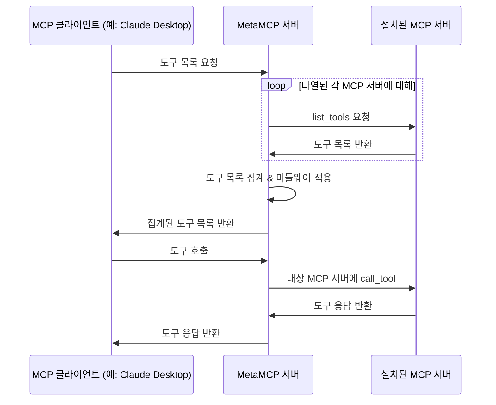
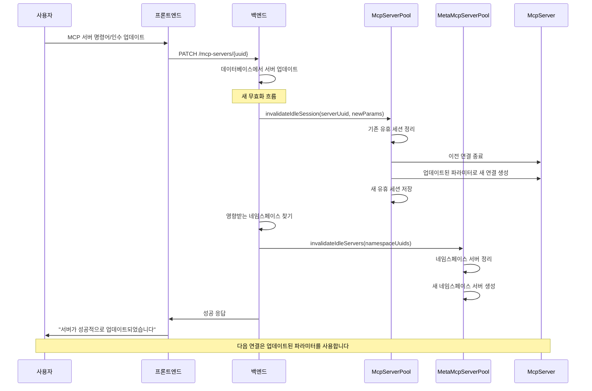

## 아키텍처 개요 (작업 중)

### 메인

```mermaid
sequenceDiagram
    participant MCPClient as MCP 클라이언트 (예: Claude Desktop)
    participant MetaMCP as MetaMCP 서버
    participant MCPServers as 설치된 MCP 서버

    MCPClient ->> MetaMCP: 도구 목록 요청

    loop 나열된 각 MCP 서버에 대해
        MetaMCP ->> MCPServers: list_tools 요청
        MCPServers ->> MetaMCP: 도구 목록 반환
    end

    MetaMCP ->> MetaMCP: 도구 목록 집계 & 미들웨어 적용
    MetaMCP ->> MCPClient: 집계된 도구 목록 반환

    MCPClient ->> MetaMCP: 도구 호출
    MetaMCP ->> MCPServers: 대상 MCP 서버에 call_tool
    MCPServers ->> MetaMCP: 도구 응답 반환
    MetaMCP ->> MCPClient: 도구 응답 반환
```

### 유휴 세션 무효화

```mermaid
sequenceDiagram
    participant User as 사용자
    participant Frontend as 프론트엔드
    participant Backend as 백엔드
    participant McpServerPool as McpServerPool
    participant MetaMcpServerPool as MetaMcpServerPool
    participant McpServer as McpServer

    User->>Frontend: MCP 서버 명령어/인수 업데이트
    Frontend->>Backend: PATCH /mcp-servers/{uuid}
    Backend->>Backend: 데이터베이스에서 서버 업데이트

    Note over Backend: 새 무효화 흐름
    Backend->>McpServerPool: invalidateIdleSession(serverUuid, newParams)
    McpServerPool->>McpServerPool: 기존 유휴 세션 정리
    McpServerPool->>McpServer: 이전 연결 종료
    McpServerPool->>McpServer: 업데이트된 파라미터로 새 연결 생성
    McpServerPool->>McpServerPool: 새 유휴 세션 저장

    Backend->>Backend: 영향받는 네임스페이스 찾기
    Backend->>MetaMcpServerPool: invalidateIdleServers(namespaceUuids)
    MetaMcpServerPool->>MetaMcpServerPool: 네임스페이스 서버 정리
    MetaMcpServerPool->>MetaMcpServerPool: 새 네임스페이스 서버 생성

    Backend->>Frontend: 성공 응답
    Frontend->>User: "서버가 성공적으로 업데이트되었습니다"

    Note over User,McpServer: 다음 연결은 업데이트된 파라미터를 사용합니다
```
